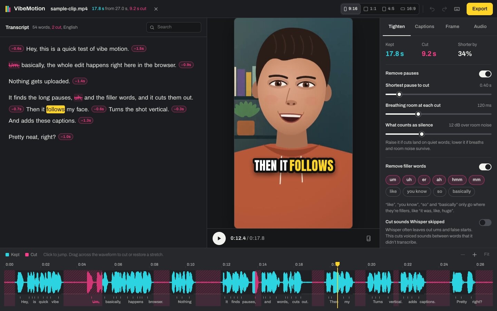
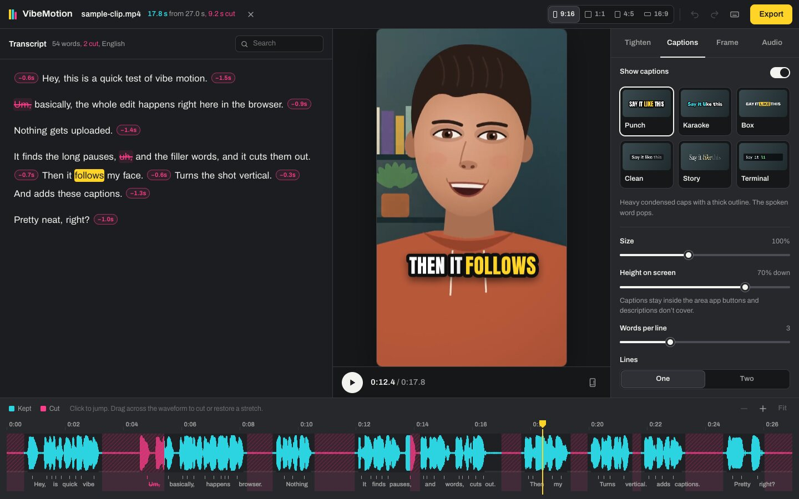
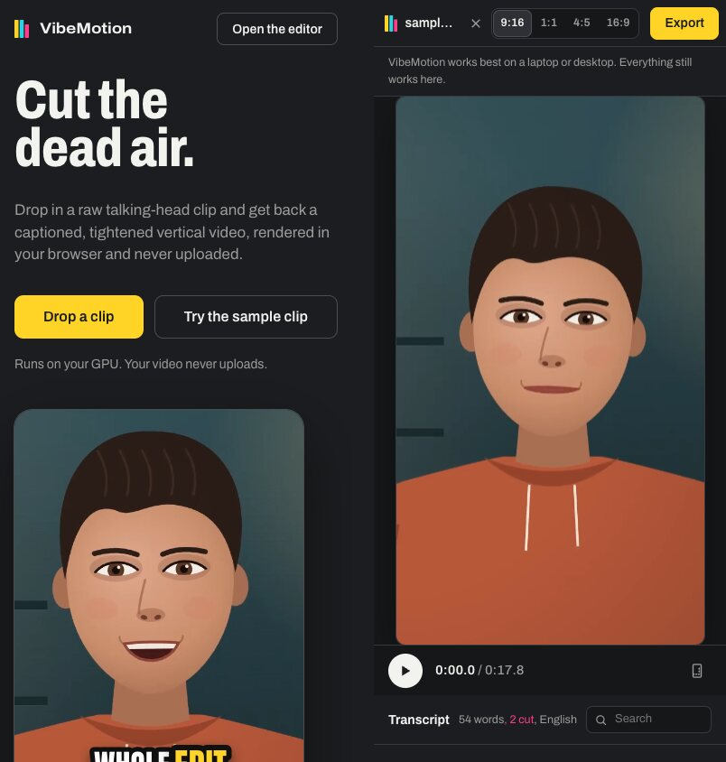

# VibeMotion

Drop in a raw talking-head clip and get back a captioned, tightened vertical video. It's rendered in your browser and never uploaded.

Try it at **[sammytourani.github.io/VibeMotion](https://sammytourani.github.io/VibeMotion/)**. It's open source under the MIT license.



VibeMotion is a short-form video editor that runs entirely on your device. There is no server: it's a static site on GitHub Pages. Transcription runs on your GPU with WebGPU, video is decoded and encoded with WebCodecs, faces are tracked with MediaPipe, and captions are drawn on a canvas. No account, no watermark, no per-video cost.

## What it does

- **Transcribes** with Whisper (Base or Small) in a Web Worker, on WebGPU when available and WebAssembly otherwise, with word-level timestamps and automatic language detection. Long files are split at quiet points into 30-second windows, so progress is real and no word is cut in half.
- **Tightens** automatically: pauses longer than you choose are shortened to a natural breath, and filler words (um, uh, er, ah, hmm, mm; optionally like, you know, so, basically) are cut. An optional pass also cuts voiced sounds between words that Whisper skipped.
- **Edits by text**, like a document: delete words in the transcript to cut them from the video, restore anything, fix spellings for the captions, search. Every edit is undoable.
- **Reframes** to 9:16, 1:1, 4:5 or 16:9. A face tracker drives a virtual camera with a deadzone and a critically damped spring, so it holds still on small movements, glides on big ones, never lets the face leave the frame, and cuts instead of panning when the shot changes. Center and manual framing too.
- **Punches in** on alternate segments to hide jump cuts.
- **Captions** word by word in six styles (Punch, Karaoke, Box, Clean, Story, Terminal), each with its own typeface, kept clear of TikTok/Reels/Shorts UI. Size, position, colours, words per line and per-word emphasis are adjustable.
- **Levels the audio** to −14 LUFS (ITU-R BS.1770, the level TikTok, Reels and YouTube play at) with a true-peak limiter at −1 dBTP, joins cuts with 10 ms crossfades, and can add a music bed that ducks under speech.
- **Exports** an MP4 (H.264 + AAC) at 1080p or 720p, plus SRT, VTT and TXT captions in edited time, and a project file you can reopen. Edits autosave in the browser.



## How it works

```
file ─▶ Mediabunny probe ─▶ audio → 16 kHz mono ─▶ VAD (pauses) ─┐
  │                                   └─▶ Whisper (Web Worker) ──┼─▶ EDL: kept segments,
  │                                                              │   source ↔ output time
  └─▶ frames @ 5 fps ─▶ BlazeFace ─▶ camera path ────────────────┤
                                                                 ▼
             preview: <video> + requestVideoFrameCallback → canvas (crop, zoom, captions)
             export:  CanvasSink.canvasesAtTimestamps → same compositor → H.264
                      decoded segments → crossfades → music → −14 LUFS → limiter → AAC
```

The edit decision list (EDL) is the one source of truth. It's a pure function of the transcript, the detected pauses, and your edits, and the preview, the export, the captions and the subtitle files all read time through it. The pure modules (`src/edit`, `src/captions`, `src/reframe`, `src/audio`, `src/asr/windows`, `src/export/subtitles`) have unit tests.

A few details that took care:

- **Language detection.** transformers.js 4.3 has no language detection yet and silently assumes English. VibeMotion runs one decoder step from `<|startoftranscript|>` and picks the most likely language token, as Whisper itself does.
- **Model size.** On GPUs with `shader-f16`, the encoder runs in fp16 and the decoder in q4f16: about half the download of the fp32/q4 pair HF's demos use (118 MB instead of 215 MB for Whisper Base), with the same words and timings on our test clip. Other GPUs get fp32/q4, and CPUs get q8.
- **Audio sync.** AAC encoders add silent priming samples (2112 on Apple's encoder, about 44 ms) and WebCodecs doesn't report them. VibeMotion measures the delay by round-tripping a tone burst, then writes an MP4 edit list that trims it, so exported speech lands within a couple of milliseconds of the picture.
- **Word timing.** Whisper often stretches the last word of a sentence into the following pause. Word edges are snapped out of detected pauses before the EDL is built, so silence removal actually removes the silence.

## Where your video goes

Nowhere. Everything happens in the browser tab. The page downloads its models once: Whisper from Hugging Face (about 120 MB for the Fast model on most GPUs), the ONNX Runtime WebAssembly module and MediaPipe's runtime from jsDelivr, and the face model from Google. Browsers cache them. None of these requests carries your video, audio or words.

## Browser support

VibeMotion feature-detects what it needs and says what will be slower or missing.

| Step | Uses | Without it |
| --- | --- | --- |
| Transcription | WebGPU | Runs on the CPU with WebAssembly: works, several times slower |
| Decoding and export | WebCodecs with an H.264 encoder | Export isn't available (the editor says so) |
| AAC audio | WebCodecs AAC encoder | A WebAssembly AAC encoder (about 1 MB) takes over |
| Face tracking | WebGL and WebAssembly | The crop stays centered; manual framing still works |
| Autosave | IndexedDB | Edits aren't kept between visits |

Built and tested in Chrome on macOS. HEVC (iPhone) clips open where the browser can decode HEVC: Safari, and Chrome on a Mac. On Windows, install Microsoft's HEVC Video Extensions or export from Photos as "Most Compatible".



## Development

Requires Node 22 and pnpm (the version is pinned in `package.json`).

```sh
pnpm install
pnpm dev          # http://localhost:5311/VibeMotion/
pnpm test         # unit tests (Vitest)
pnpm typecheck
pnpm build        # static site in dist/, served under /VibeMotion/
pnpm preview      # http://localhost:5312/VibeMotion/
pnpm e2e          # build + Playwright end-to-end tests in Google Chrome
```

The end-to-end tests drive real Google Chrome (Playwright's bundled Chromium has no H.264 or AAC encoder) and check exports with `ffprobe`, so they need Chrome and ffmpeg installed. The first run downloads the Whisper model into a persistent profile (`e2e/.artifacts/profile`, or set `VM_PW_PROFILE`). `VM_E2E_WASM=1` also runs the WebAssembly transcription test.

Scripts in `scripts/`:

- `make-sample.mjs` generates `public/sample/sample.mp4` locally: narration from macOS `say`, a presenter drawn in Canvas 2D, x264/AAC via ffmpeg. No third-party footage.
- `make-landing-data.mjs` runs the real pipeline on the sample and saves the words, pauses, face path and waveform the landing page replays (needs `pnpm dev`).
- `screenshots.mjs` captures `public/og.png` and the images in `docs/` (needs `pnpm preview`).

```
src/
  app/        routing, landing → editor handoff
  landing/    the landing page (replays the sample with the editor's engine)
  editor/     editor UI, store, preview engine, timeline
  edit/       EDL, VAD, fillers, intervals, undo history        (pure, tested)
  asr/        Whisper worker, client, model table, windowing
  captions/   layout, styles, fonts, canvas renderer
  reframe/    face detection, camera path, crop geometry
  audio/      loudness, true-peak limiter, splicing, ducking     (pure, tested)
  media/      probe and decode (Mediabunny)
  export/     MP4 export, SRT/VTT/TXT
  render/     the frame compositor shared by preview, export and landing
  project/    the Project type, defaults, IndexedDB autosave
```

## License

MIT. See [LICENSE](LICENSE).
